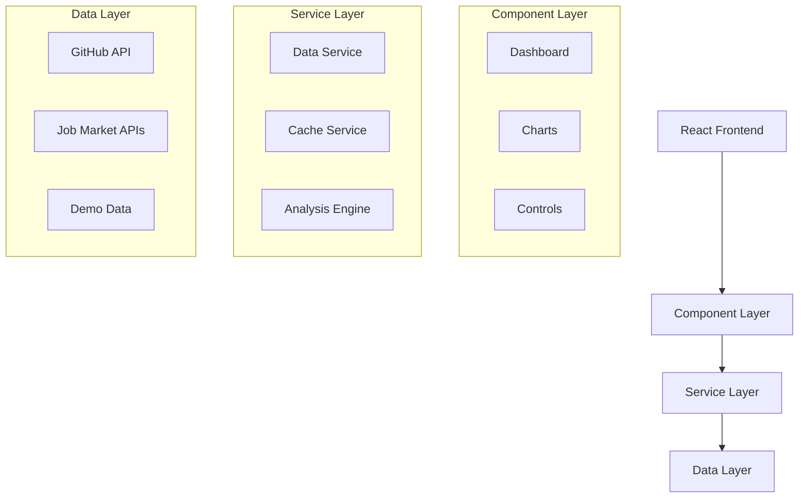

# Developer Guide

## 🛠️ Development Environment Setup

### Prerequisites

- **Node.js**: 18.0.0 or higher
- **npm**: 8.0.0 or higher (or yarn 1.22.0+)
- **Git**: Latest version
- **VS Code**: Recommended IDE with extensions

### Recommended VS Code Extensions

```json
{
  "recommendations": [
    "bradlc.vscode-tailwindcss",
    "esbenp.prettier-vscode",
    "dbaeumer.vscode-eslint",
    "ms-vscode.vscode-typescript-next",
    "bradlc.vscode-tailwindcss",
    "ms-vscode.test-adapter-converter"
  ]
}
```

### Initial Setup

```bash
# Clone the repository
git clone https://github.com/your-org/workforce-impact-dashboard.git
cd workforce-impact-dashboard

# Install dependencies
npm install

# Set up environment variables
cp .env.example .env

# Start development server
npm run dev
```

## 🏗️ Architecture Overview

### High-Level Architecture



### Design Patterns

#### 1. Service Layer Pattern
- **Purpose**: Separate business logic from UI components
- **Implementation**: Services handle API calls, data processing, and caching
- **Benefits**: Testable, reusable, maintainable

#### 2. Observer Pattern
- **Purpose**: Reactive state management
- **Implementation**: Zustand for lightweight state management
- **Benefits**: Predictable state updates, easy debugging

#### 3. Strategy Pattern
- **Purpose**: Interchangeable data sources and processing algorithms
- **Implementation**: Different API clients and analysis strategies
- **Benefits**: Flexible, extensible, testable

## 📁 Project Structure

```
workforce-impact-dashboard/
├── 📁 src/
│   ├── 📁 components/          # React components
│   │   ├── Dashboard.tsx       # Main container
│   │   ├── RoleExplorer.tsx    # Role selection
│   │   ├── TimeSlider.tsx      # Time range control
│   │   ├── charts/             # Chart components
│   │   └── ui/                 # Reusable UI components
│   ├── 📁 services/            # Business logic layer
│   │   ├── dataService.ts      # Main data orchestration
│   │   ├── githubApi.ts        # GitHub API client
│   │   ├── jobMarketApi.ts     # Job market API client
│   │   ├── cacheService.ts     # Caching implementation
│   │   ├── analysisEngine.ts   # Impact calculations
│   │   └── demoService.ts      # Demo mode management
│   ├── 📁 types/               # TypeScript definitions
│   │   └── index.ts            # All type exports
│   ├── 📁 utils/               # Utility functions
│   │   ├── constants.ts        # App constants
│   │   ├── dataTransformation.ts # Data processing
│   │   ├── validation.ts       # Input validation
│   │   └── chartSync.ts        # Chart coordination
│   ├── 📁 data/                # Sample data and generators
│   │   └── sampleData.ts       # Demo data sets
│   ├── 📁 styles/              # Global styles
│   │   ├── index.css           # Main stylesheet
│   │   └── accessibility.css   # A11y styles
│   └── 📁 __tests__/           # Test suites
│       ├── unit/               # Unit tests
│       ├── property/           # Property-based tests
│       └── test-utils.tsx      # Test utilities
├── 📁 docs/                    # Documentation
├── 📁 k8s/                     # Kubernetes manifests
├── 📁 scripts/                 # Build and deployment scripts
├── 📄 Dockerfile              # Container configuration
├── 📄 docker-compose.yml      # Multi-container setup
└── 📄 vite.config.ts          # Build configuration
```

## 🧩 Component Architecture

### Component Hierarchy

```
Dashboard (Container)
├── DemoModeSelector
├── Controls
│   ├── RoleExplorer
│   └── TimeSlider
├── Navigation
│   └── ViewModeSelector
├── MainContent
│   ├── OverviewCards
│   ├── Charts
│   │   ├── TimeSeriesChart
│   │   ├── ImpactScoreChart
│   │   └── RoleComparisonChart
│   ├── ComparisonPanel
│   ├── ImpactMatrix
│   └── InsightPanel
├── DataExport
└── DemoTour
```

### Component Design Principles

#### 1. Single Responsibility
Each component has one clear purpose:
```typescript
// ✅ Good: Focused component
const RoleExplorer: React.FC<RoleExplorerProps> = ({ 
  roles, 
  selectedRole, 
  onRoleSelect 
}) => {
  // Only handles role selection logic
};

// ❌ Bad: Multiple responsibilities
const Dashboard: React.FC = () => {
  // Don't mix data fetching, UI rendering, and business logic
};
```

#### 2. Props Interface Design
```typescript
// ✅ Good: Clear, typed props
interface TimeSliderProps {
  timeRange: [Date, Date];
  selectedPeriod: [Date, Date];
  onPeriodChange: (period: [Date, Date]) => void;
  granularity: 'month' | 'quarter' | 'year';
}

// ❌ Bad: Unclear or any types
interface BadProps {
  data: any;
  onChange: (value: any) => void;
}
```

#### 3. State Management
```typescript
// ✅ Good: Local state for UI, global for shared data
const [isExpanded, setIsExpanded] = useState(false); // UI state
const selectedRole = useStore(state => state.selectedRole); // Global state

// ❌ Bad: Everything in global state
const isExpanded = useStore(state => state.isExpanded); // UI state shouldn't be global
```

## 🔧 Service Layer

### Data Service Architecture

```typescript
class DataService {
  constructor(
    private githubApi: GitHubApiClient,
    private jobMarketApi: JobMarketApiClient,
    private cacheService: CacheService,
    private analysisEngine: AnalysisEngine
  ) {}

  async fetchAIGrowthData(timeRange: [Date, Date]): Promise<AIGrowthData> {
    // 1. Check cache
    const cached = await this.cacheService.get(`ai-growth-${timeRange.join('-')}`);
    if (cached) return cached;

    // 2. Fetch from API
    const data = await this.githubApi.fetchAIRepositories(timeRange);
    
    // 3. Process and cache
    const processed = this.analysisEngine.processAIData(data);
    await this.cacheService.set(`ai-growth-${timeRange.join('-')}`, processed, 3600);
    
    return processed;
  }
}
```

### API Client Pattern

```typescript
abstract class BaseApiClient {
  protected baseURL: string;
  protected timeout: number;
  protected retries: number;

  protected async request<T>(endpoint: string, options?: RequestOptions): Promise<T> {
    // Implement retry logic, error handling, rate limiting
  }
}

class GitHubApiClient extends BaseApiClient {
  async fetchRepositories(query: string): Promise<GitHubRepository[]> {
    return this.request(`/search/repositories?q=${encodeURIComponent(query)}`);
  }
}
```

### Caching Strategy

```typescript
interface CacheEntry<T> {
  data: T;
  timestamp: number;
  expiresAt: number;
  version: string;
}

class CacheService {
  private memoryCache = new Map<string, CacheEntry<any>>();
  
  async get<T>(key: string): Promise<T | null> {
    // 1. Check memory cache
    const memoryEntry = this.memoryCache.get(key);
    if (memoryEntry && memoryEntry.expiresAt > Date.now()) {
      return memoryEntry.data;
    }
    
    // 2. Check localStorage
    const stored = localStorage.getItem(`cache:${key}`);
    if (stored) {
      const entry: CacheEntry<T> = JSON.parse(stored);
      if (entry.expiresAt > Date.now()) {
        this.memoryCache.set(key, entry);
        return entry.data;
      }
    }
    
    return null;
  }
}
```

## 🧪 Testing Strategy

### Testing Pyramid

```
    🔺 E2E Tests (Few)
   🔺🔺 Integration Tests (Some)
  🔺🔺🔺 Unit Tests (Many)
 🔺🔺🔺🔺 Property Tests (Comprehensive)
```

### Property-Based Testing

Property-based tests verify universal properties across all inputs:

```typescript
// Test data normalization consistency
fc.assert(
  fc.property(
    arbitraries.timeSeriesData(),
    arbitraries.timeRange(),
    (data, range) => {
      const normalized = normalizeTimeSeriesData(data, range);
      
      // Property: All normalized points should be within range
      return normalized.every(point => 
        point.timestamp >= range[0] && 
        point.timestamp <= range[1]
      );
    }
  ),
  { numRuns: 100 }
);
```

### Test Utilities

```typescript
// Custom render function with providers
export function renderWithProviders(
  ui: React.ReactElement,
  options?: RenderOptions
) {
  const Wrapper: React.FC<{ children: React.ReactNode }> = ({ children }) => (
    <ErrorBoundary>
      <TestDataProvider>
        {children}
      </TestDataProvider>
    </ErrorBoundary>
  );

  return render(ui, { wrapper: Wrapper, ...options });
}

// Data generators for testing
export const arbitraries = {
  jobRole: () => fc.record({
    id: fc.string({ minLength: 1 }),
    name: fc.string({ minLength: 1 }),
    category: fc.constantFrom('ai-ml', 'development', 'design'),
    aliases: fc.array(fc.string())
  }),
  
  timeSeriesPoint: () => fc.record({
    timestamp: fc.date(),
    value: fc.float({ min: 0, max: 10000 }),
    confidence: fc.float({ min: 0, max: 1 }),
    isEstimated: fc.boolean()
  })
};
```

### Testing Best Practices

#### 1. Test Structure (AAA Pattern)
```typescript
test('should calculate impact score correctly', () => {
  // Arrange
  const aiGrowthRate = 50;
  const jobDemandChange = 20;
  
  // Act
  const result = calculateImpactScore(aiGrowthRate, jobDemandChange);
  
  // Assert
  expect(result).toBe(30);
});
```

#### 2. Mock External Dependencies
```typescript
// Mock API clients
jest.mock('../services/githubApi', () => ({
  GitHubApiClient: jest.fn().mockImplementation(() => ({
    fetchRepositories: jest.fn().mockResolvedValue(mockRepositories)
  }))
}));
```

#### 3. Test Error Scenarios
```typescript
test('should handle API failures gracefully', async () => {
  const mockApi = {
    fetchData: jest.fn().mockRejectedValue(new Error('API Error'))
  };
  
  const result = await dataService.fetchWithFallback(mockApi);
  
  expect(result).toEqual(fallbackData);
});
```

## 🎨 Styling and Theming

### CSS Architecture

```
styles/
├── index.css              # Global styles and CSS reset
├── accessibility.css      # A11y-specific styles
├── components/            # Component-specific styles
│   ├── Dashboard.css
│   ├── RoleExplorer.css
│   └── ...
└── utilities/             # Utility classes
    ├── layout.css
    ├── typography.css
    └── colors.css
```

### Design System

#### Color Palette
```css
:root {
  /* Primary Colors */
  --color-primary: #667eea;
  --color-primary-dark: #5a67d8;
  --color-primary-light: #7c3aed;
  
  /* Status Colors */
  --color-success: #10b981;
  --color-warning: #f59e0b;
  --color-error: #ef4444;
  
  /* Neutral Colors */
  --color-gray-50: #f9fafb;
  --color-gray-900: #111827;
}
```

#### Typography Scale
```css
:root {
  --font-size-xs: 0.75rem;
  --font-size-sm: 0.875rem;
  --font-size-base: 1rem;
  --font-size-lg: 1.125rem;
  --font-size-xl: 1.25rem;
  --font-size-2xl: 1.5rem;
  --font-size-3xl: 1.875rem;
}
```

#### Responsive Breakpoints
```css
:root {
  --breakpoint-sm: 640px;
  --breakpoint-md: 768px;
  --breakpoint-lg: 1024px;
  --breakpoint-xl: 1280px;
}
```

### Component Styling Patterns

#### 1. BEM Methodology
```css
/* Block */
.dashboard { }

/* Element */
.dashboard__header { }
.dashboard__content { }

/* Modifier */
.dashboard--loading { }
.dashboard__header--compact { }
```

#### 2. CSS Custom Properties for Theming
```css
.chart-container {
  background: var(--chart-background, rgba(255, 255, 255, 0.1));
  border: 1px solid var(--chart-border, rgba(255, 255, 255, 0.2));
  border-radius: var(--border-radius, 0.5rem);
}
```

#### 3. Responsive Design Patterns
```css
.dashboard-grid {
  display: grid;
  grid-template-columns: 1fr;
  gap: 1rem;
}

@media (min-width: 768px) {
  .dashboard-grid {
    grid-template-columns: 1fr 1fr;
    gap: 2rem;
  }
}

@media (min-width: 1024px) {
  .dashboard-grid {
    grid-template-columns: 1fr 1fr 1fr;
  }
}
```

## 🔧 Build and Development Tools

### Vite Configuration

```typescript
export default defineConfig({
  plugins: [react()],
  resolve: {
    alias: {
      '@': path.resolve(__dirname, './src'),
      '@/components': path.resolve(__dirname, './src/components'),
      '@/services': path.resolve(__dirname, './src/services'),
    },
  },
  build: {
    rollupOptions: {
      output: {
        manualChunks: {
          vendor: ['react', 'react-dom'],
          charts: ['recharts'],
          utils: ['date-fns', 'axios'],
        },
      },
    },
  },
});
```

### ESLint Configuration

```javascript
module.exports = {
  extends: [
    '@typescript-eslint/recommended',
    'plugin:react/recommended',
    'plugin:react-hooks/recommended',
  ],
  rules: {
    '@typescript-eslint/no-unused-vars': 'error',
    '@typescript-eslint/explicit-function-return-type': 'warn',
    'react/prop-types': 'off',
    'react/react-in-jsx-scope': 'off',
  },
};
```

### TypeScript Configuration

```json
{
  "compilerOptions": {
    "target": "ES2020",
    "lib": ["ES2020", "DOM", "DOM.Iterable"],
    "module": "ESNext",
    "skipLibCheck": true,
    "moduleResolution": "bundler",
    "allowImportingTsExtensions": true,
    "resolveJsonModule": true,
    "isolatedModules": true,
    "noEmit": true,
    "jsx": "react-jsx",
    "strict": true,
    "noUnusedLocals": true,
    "noUnusedParameters": true,
    "noFallthroughCasesInSwitch": true,
    "baseUrl": ".",
    "paths": {
      "@/*": ["./src/*"],
      "@/components/*": ["./src/components/*"],
      "@/services/*": ["./src/services/*"]
    }
  }
}
```

## 🚀 Performance Optimization

### Code Splitting

```typescript
// Lazy load heavy components
const ImpactMatrix = lazy(() => import('./ImpactMatrix'));
const ComparisonPanel = lazy(() => import('./ComparisonPanel'));

// Use Suspense for loading states
<Suspense fallback={<LoadingSpinner />}>
  <ImpactMatrix roles={roles} />
</Suspense>
```

### Memoization

```typescript
// Memoize expensive calculations
const impactScores = useMemo(() => 
  calculateImpactScores(aiData, jobData),
  [aiData, jobData]
);

// Memoize components with stable props
const MemoizedChart = memo(TimeSeriesChart);
```

### Bundle Analysis

```bash
# Analyze bundle size
npm run build
npx vite-bundle-analyzer dist

# Check for duplicate dependencies
npx duplicate-package-checker-webpack-plugin
```

## 🔒 Security Best Practices

### Environment Variables

```typescript
// ✅ Good: Validate environment variables
const config = {
  githubToken: process.env.VITE_GITHUB_TOKEN || '',
  apiBaseUrl: process.env.VITE_API_BASE_URL || 'https://api.default.com',
};

if (!config.githubToken && process.env.NODE_ENV === 'production') {
  throw new Error('GitHub token is required in production');
}

// ❌ Bad: Direct access without validation
const token = process.env.VITE_GITHUB_TOKEN; // Could be undefined
```

### Input Validation

```typescript
// Validate API responses
const validateJobRoleData = (data: unknown): JobRoleData => {
  if (!data || typeof data !== 'object') {
    throw new Error('Invalid job role data');
  }
  
  const role = data as Partial<JobRoleData>;
  
  if (!role.roleId || typeof role.roleId !== 'string') {
    throw new Error('Invalid role ID');
  }
  
  return role as JobRoleData;
};
```

### Content Security Policy

```html
<meta http-equiv="Content-Security-Policy" 
      content="default-src 'self'; 
               script-src 'self' 'unsafe-inline'; 
               style-src 'self' 'unsafe-inline'; 
               img-src 'self' data: https:;">
```

## 📊 Monitoring and Debugging

### Error Tracking

```typescript
// Error boundary for React components
class ErrorBoundary extends Component<Props, State> {
  componentDidCatch(error: Error, errorInfo: ErrorInfo) {
    // Log to error tracking service
    console.error('Component error:', error, errorInfo);
    
    // Report to monitoring service
    if (process.env.NODE_ENV === 'production') {
      // Sentry.captureException(error);
    }
  }
}
```

### Performance Monitoring

```typescript
// Performance measurement
const measurePerformance = (name: string, fn: () => void) => {
  const start = performance.now();
  fn();
  const end = performance.now();
  
  console.log(`${name} took ${end - start} milliseconds`);
  
  // Report to analytics
  if (process.env.NODE_ENV === 'production') {
    // analytics.track('performance', { name, duration: end - start });
  }
};
```

### Debug Utilities

```typescript
// Debug mode helpers
const debug = {
  log: (message: string, data?: any) => {
    if (process.env.NODE_ENV === 'development') {
      console.log(`[DEBUG] ${message}`, data);
    }
  },
  
  time: (label: string) => {
    if (process.env.NODE_ENV === 'development') {
      console.time(label);
    }
  },
  
  timeEnd: (label: string) => {
    if (process.env.NODE_ENV === 'development') {
      console.timeEnd(label);
    }
  }
};
```

## 🤝 Contributing Guidelines

### Code Review Checklist

- [ ] **Functionality**: Does the code work as intended?
- [ ] **Tests**: Are there adequate tests with good coverage?
- [ ] **Performance**: Are there any performance implications?
- [ ] **Security**: Are there any security vulnerabilities?
- [ ] **Accessibility**: Is the code accessible to all users?
- [ ] **Documentation**: Is the code well-documented?
- [ ] **Style**: Does the code follow project conventions?

### Git Workflow

```bash
# Feature development
git checkout -b feature/new-feature
git commit -m "feat: add new feature"
git push origin feature/new-feature

# Create pull request
# After review and approval
git checkout main
git pull origin main
git merge feature/new-feature
git push origin main
```

### Commit Message Format

```
type(scope): description

[optional body]

[optional footer]
```

Types: `feat`, `fix`, `docs`, `style`, `refactor`, `test`, `chore`

## 📚 Additional Resources

### Learning Materials
- **React Documentation**: https://react.dev
- **TypeScript Handbook**: https://www.typescriptlang.org/docs
- **Vite Guide**: https://vitejs.dev/guide
- **Testing Library**: https://testing-library.com

### Tools and Extensions
- **React Developer Tools**: Browser extension for debugging
- **TypeScript Error Translator**: Better error messages
- **Bundle Analyzer**: Visualize bundle composition
- **Lighthouse**: Performance and accessibility auditing

### Community
- **GitHub Discussions**: Project-specific questions
- **Stack Overflow**: General development questions
- **Discord/Slack**: Real-time community support

---

**Happy coding! 🚀**

*This guide is continuously updated. Check back for new patterns and best practices.*